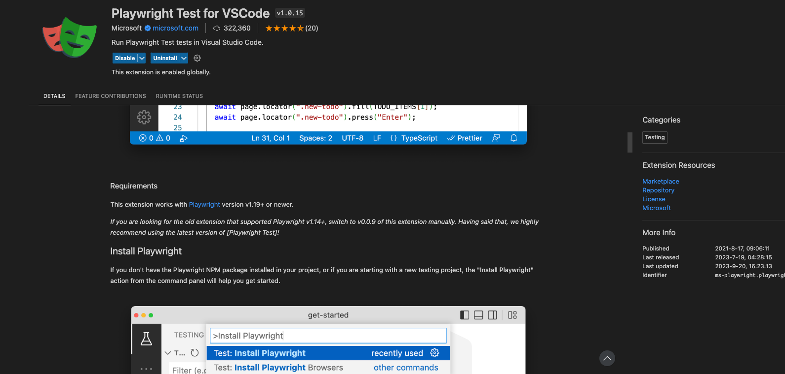
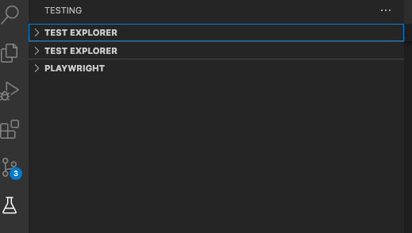

# Reproduction of no test detected

Notice where is the `playwright.config.ts` - it is burried.

There are 2 configs `ui-app1` and `ui-app2`

## Met all the Requirements


### npx playwright test
CLI works
```

Running 4 tests using 2 workers

  ✓  1 projects/ui-app1/e2e/example.spec.ts:3:5 › has title (1.0s)
  ✓  2 projects/ui-app2/e2e/example2.spec.ts:3:5 › has title (976ms)
  ✓  3 projects/ui-app2/e2e/example2.spec.ts:10:5 › get started link (1.2s)
  ✓  4 projects/ui-app1/e2e/example.spec.ts:10:5 › get started link (1.3s)

  4 passed (3.3s)
```

### TEST EXPLORER does not work
![No tests have been found in this worksp[ace yet.]](image-2.png)

### Other issue (unrelated)


This is general vscode Testing where i see multiple TEST EXPLORER as I have different extendions to test different things e.g. unit test I might use jasmine/karma/jest and e2e playwright. How am i supposed to distinguish between them without opening ?
